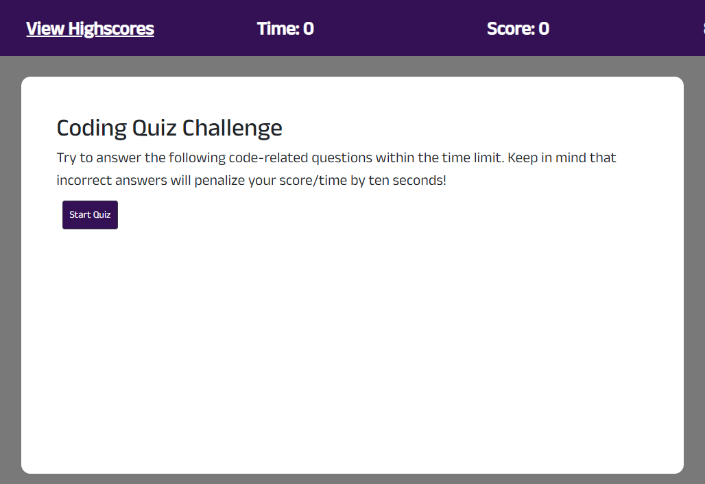
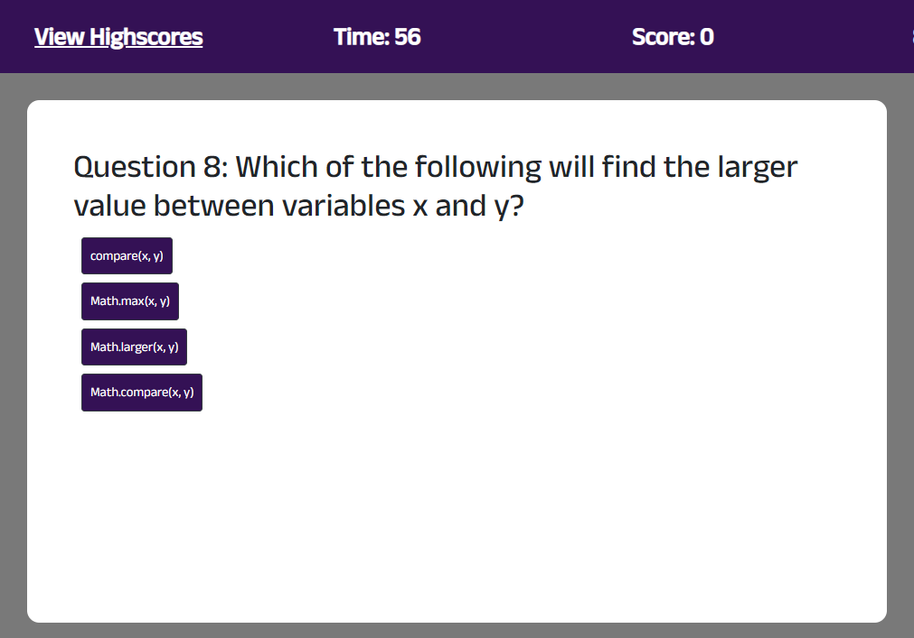
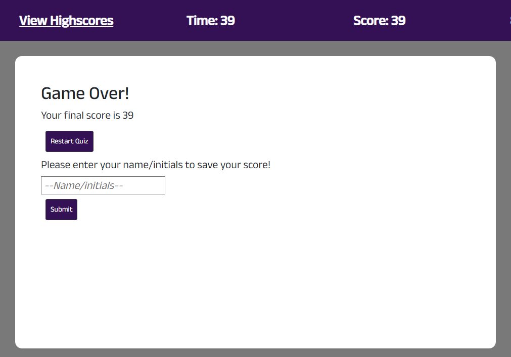
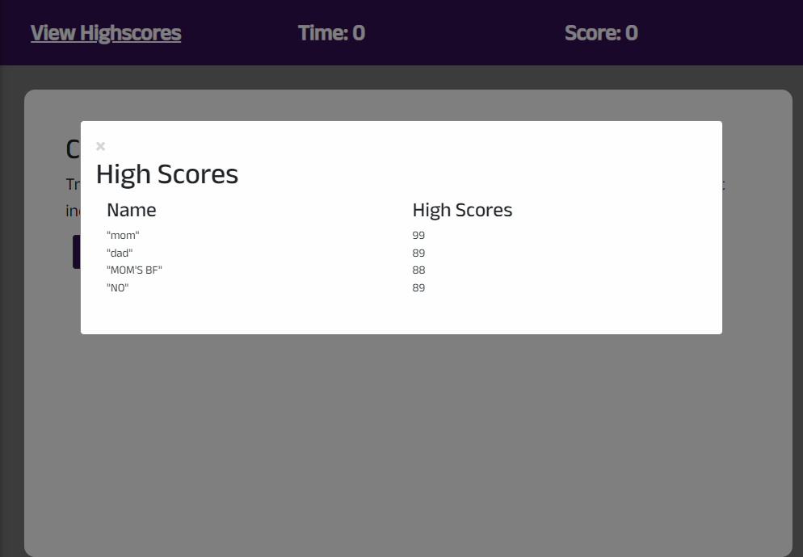

# Challenge 04:  Web Api Code Quiz

By Vincent Yang

* Quiz featuring 10 JavaScript questions! 
* User has 100 seconds to complete the quiz. Answering incorrectly will deduct 10 seconds from the timer!
* The game will end when all 10 questions are answered or when the timer drops to zero!
* The user's final score will be the amount of time remaining at the end of the quiz.
* User has the ability to enter their initials at the end of the quiz and have it saved to local storage.
* The high score modal opens when user clicks on the "View Highscores" header at the top of the window. This will show the saved scores and names/initials in a modal window.

>Quiz Landing Page
 

>During the Quiz
 

>Game Over
 

>Highscore Form
 

https://github.com/vyang14/web-api-code-quiz-Vyang
https://vyang14.github.io/web-api-code-quiz-Vyang/